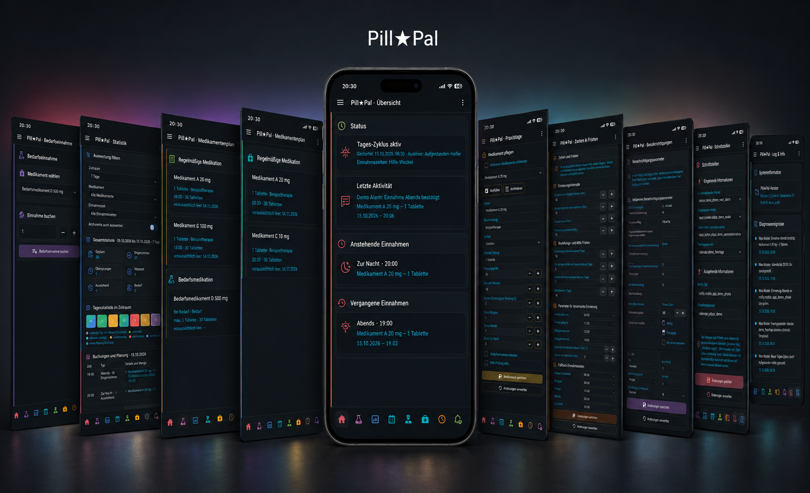

# Pill★Pal

Pill★Pal is a Home Assistant–based medication manager optimized for mobile screens that goes beyond a simple alarm or calendar reminder. It actively supports the entire medication routine—from scheduled reminders to confirmation and documentation.

- User-based management with individual medication plans, schedules, and notifications
- Flexible intake times calculated dynamically from wake-up helpers and the smartphone alarm set for waking up the next day
- Flexible schedules and dosage plans for multiple medications
- Actionable notifications to mark doses as taken, snooze them, or skip them
- Automatic tracking of pending, taken, skipped, and missed doses
- Inventory monitoring with alerts for low stock and approaching expiration dates
- Timely refill reminders that take medical practice closure periods into account
- A central dashboard showing upcoming and past intakes with additional statistics
- Support for as-needed medication and configurable safety limits
- Optional admin-assisted medication intake

# Upcoming Features

* **Multi-language Support**  
  Support for languages other than German and English

* **Edit Dose History**  
  Correction of taken or skipped doses  

* **Extended Interval Settings**  
  Support for complex schedules (e.g., "every 2nd Tuesday of the month")  

* **Import / Export**  
  Import and export functionality

## Prerequisites

- Home Assistant 2026.8.0 or newer
- At least one person created under **Settings → People**
- HACS installed for convenient installation and updates

## Installation for Testing

### Option 1: Via HACS (Recommended)

1. Open **HACS** in your Home Assistant sidebar.
2. Click the **three dots** in the top right corner and select **Custom repositories**.
3. Paste the repository URL: `https://github.com/ToPa451/PillPal`
4. Set the Type to **Integration** and click **Add**.
5. Find **Pill★Pal** in HACS, click **Download**, and restart Home Assistant when prompted.

### Option 2: Manual Installation

1. Copy the `custom_components/pillpal` folder to `/config/custom_components/pillpal`. When performing a manual update, replace the existing folder completely rather than merging it with the new content. This ensures that no old files remain behind, particularly in `__pycache__`.
2. Restart Home Assistant completely.

### Setup & Initial Configuration

1. Open **Settings → Devices & Services → Add Integration → Pill★Pal**.
2. Select the people to include and specify whether to start with an inactive example medication or empty. For individuals with their own login, assistance by administrators can optionally be allowed. Individuals without a login are automatically assisted.
3. Open the personal dashboard **Pill★Pal** or, as an administrator, **Pill★Pal Assistance**. A Home Assistant restart is not required after the setup wizard; if your browser is already open, a single reload with `Ctrl+F5` may be necessary.

## User Manual

### Open Pill★Pal and move around

Pill★Pal adds its dashboards automatically; no Lovelace resource or dashboard YAML is required.

- **Pill★Pal** is the personal dashboard. A signed-in user sees only the profile linked to their Home Assistant person.
- **Pill★Pal Assistance** is available to administrators and contains only profiles for which assistance is enabled. Select the person you want to support before performing an action.
- Use the navigation bar or swipe horizontally across an empty area of the page. Swipes that begin on controls, forms, tables, or the log do not change pages.
- On a narrow screen, use the menu button in the Pill★Pal header to open the Home Assistant sidebar.

If a dashboard does not appear immediately after setup, reload the browser with `Ctrl+F5` or restart the Companion App.

### Recommended first-time configuration

Complete these steps for each person before relying on reminders:

1. Open **Interfaces** and select a notification target, usually the person's `notify.mobile_app_…` service.
2. Optionally select a next-alarm sensor, an awake helper, a collective-confirmation helper, a holiday calendar, and an intake calendar.
3. Open **Times** and review the fixed fallback times, the fallback wake-up time, the early-intake window, snooze duration, and reminder interval.
4. Open **Notifications** and adjust the message text and the Android or iOS notification behavior.
5. Open **Practice** and add the person's doctors, including opening hours and known closures. This makes the doctors available for assignment while creating medication.
6. Open **Manage** and add the person's medications and doses, assigning a previously created doctor where applicable.
7. Check **Overview**. Pill★Pal warns you if regular medication has neither a notification target nor an enabled **Intake Due** entity as a reminder channel.

Use **Save Changes** on each settings page. **Discard Changes** restores the last saved values. Pill★Pal asks before leaving a page or medication with unsaved changes.

### Configure intake times

The **Times** page controls when regular doses become due.

- **Fallback times** define reliable fixed times for morning, noon, evening, and night.
- **Fallback wake-up time** starts a daily cycle when no awake helper is used.
- A configured **awake helper** can start the daily cycle when the person gets up. The morning dose follows after the configured wake-up delay.
- A configured **next-alarm sensor** dynamically derives morning, evening, and night times when its value falls inside the configured valid alarm window. Fixed times remain available as fallbacks.
- **Allow intake before due** makes a dose bookable shortly before its due time.
- **Snooze duration** sets the default postponement; **repeat interval** controls repeated reminders.

After changing a time plan, save it and check the calculated times on **Overview**.

### Add doctors and account for practice closures

Create the relevant doctors before adding medication so that every medication can be assigned correctly from the start. Use **Practice** to add a doctor, contact details, opening hours, and current or future closure periods.

When a holiday calendar is selected under **Interfaces**, Pill★Pal considers its events together with weekends, opening hours, and the assigned doctor's closures. If necessary, the effective reorder date is moved forward so that enough open practice days remain before stock is depleted. Medication without an assigned doctor does not use practice-specific closures.

A doctor cannot be deleted while medication is still assigned to them. Reassign or archive the affected medication first.

### Add and manage medication

After creating the relevant doctors under **Practice**, open **Manage**, choose **New medication**, and complete the medication form.

1. Enter a unique name and, optionally, a description. Select one of the doctors created on the **Practice** page, or leave the medication unassigned if no practice-specific planning is required.
2. Choose the unit and the smallest allowed division. This division is used for doses, stock, refills, and as-needed quantities.
3. Enter the package size, current stock, and optional cost or copayment.
4. Enter a dose for every applicable time of day. Leave unused intake times at zero.
5. If applicable, enable **As-needed intake**, set the maximum single and daily doses, and optionally select a button helper.
6. If desired, enable expiration checking and enter the earliest expiration date in stock.
7. Select **Save medication**.

Use **Refill** to add a delivery to the current stock and update its expiration date. Use **Archive** when a medication is no longer active. Archived medication remains in the history and can be shown in management or statistics through the relevant archive filter. Reactivating it restores future planning, but does not create doses retrospectively.

### Handle the daily medication routine

The **Overview** page groups due, early-bookable, upcoming, and past intakes. Each regular intake slot can be handled in one of three ways:

- **Confirm** records the dose as taken and deducts the planned amount from stock.
- **Snooze** postpones the reminder by the configured duration. Snoozing again extends it.
- **Skip** records the dose as skipped without changing stock.

The same actions are available in actionable mobile notifications when a notification target is configured. Old or already-used notification actions are rejected safely. If no action is taken before the cycle closes, the intake is recorded as missed.

### Record as-needed medication

Open **As needed**, select a medication, adjust the amount with the available step buttons, and confirm the booking. Pill★Pal checks the smallest division, available stock, and configured maximum single and daily doses.

An optional medication-specific input button can also record an intake. If the medication has a regular dose due at that moment, the button confirms that regular dose first; a pure as-needed medication is recorded as an as-needed intake.

### Monitor stock, orders, and expiration dates

The **Stock** page lists regular and as-needed medication, current stock, projected depletion dates, reorder suggestions, costs, and expiration warnings. You can filter the medication plan by doctor or show only medication without an assigned doctor.

Pill★Pal estimates depletion from the current stock and regular daily dose. The lead times on **Times** determine when an order becomes due and which additional low-stock medication should be included in the same order. Review the generated order text before copying or sending it.

### Configure notifications and calendars

On **Notifications**, you can customize titles, action labels, the shared icon, and platform-specific behavior. Android options include channel, importance, priority, vibration, visibility, and persistence. iOS options include sound, interruption level, foreground presentation, volume, badge, and critical sound.

On **Interfaces**, you can connect:

- a mobile notify target for actionable reminders;
- a next-alarm sensor for dynamic times;
- an awake helper and confirmation helpers;
- a holiday calendar for reorder planning; and
- an intake calendar for completed, skipped, missed, and as-needed entries.

Changing the notify target moves active Pill★Pal notices to the new device where possible. Dashboard actions clear the related alarm but do not send an extra mobile confirmation.

### Review statistics and history

The **Statistics** page shows planned, taken, skipped, missed, pending, and as-needed intakes as well as adherence. Filter the results by period, custom date range, medication, doctor, or intake time. Select a day in the heatmap to inspect its details.

Completed historical entries retain the medication, amount, unit, and doctor recorded at that time. Later edits to a medication plan do not rewrite completed history. Archived medication can be included with the archive toggle.

### Use Home Assistant entities and actions

Pill★Pal creates a separate Home Assistant device for each person. This allows dashboards and automations to use Pill★Pal data without reading the custom dashboard itself.

#### Available sensors and controls

| Entity | What it provides |
| --- | --- |
| **Status** | A summary of the person's current Pill★Pal state. |
| **Next Intake** | The next planned intake and its time. |
| **Morning**, **Noon**, **Evening**, and **Night Intake** | One stable sensor per regular slot. The state shows whether it is planned, pending, notified, snoozed, taken, skipped, missed, or not planned. Attributes include the calculated due time, medication, amounts, cycle, snooze time, and completion time where applicable. |
| **Reorders** | Current reorder requirements and machine-readable details such as medication, doctor, stock, projected depletion, suggested order date, package size, and cost. |
| **Expiry Alerts** | Medication currently inside the configured expiration-warning period. |
| **Practice Status** | Whether the relevant practice is open or closed, the reason, and the next open day. |
| **Adherence** | The calculated adherence value plus a 30-day history with daily details. |
| **Last Activity** | The most recent recorded Pill★Pal activity for the person. |
| **Action Result** | The state and details of the latest dashboard, script, or automation action: pending, success, or error. |
| **Planned**, **Taken**, **Skipped**, **Missed**, and **As-needed Intake** statistics | Separate counters for use in dashboards and automations. These statistic entities are disabled by default and can be enabled from the Pill★Pal device page when needed. |

The **Intake Due** binary sensor turns on when action is required, while **Intake Possible** also covers doses inside the permitted early-intake window. **Daily Cycle Complete** indicates that all planned slots for the current cycle have reached a final state. **Reminder Configured** indicates whether the profile has a usable mobile notify target or an enabled **Intake Due** entity as its reminder channel.

The device also supplies buttons for **Confirm**, **Snooze**, and **Skip**. These operate on the currently relevant intake slot and are useful on Home Assistant dashboards. For more specific automation logic, use the actions below.

#### Available actions

Pill★Pal also provides actions under `pillpal.*`. They can be called manually from **Developer Tools → Actions**, used in scripts, or combined with triggers, conditions, templates, calendars, RSS data, and AI tasks in Home Assistant automations.

| Purpose | Actions |
| --- | --- |
| Daily intake | `pillpal.confirm_slot`, `pillpal.snooze_slot`, `pillpal.skip_slot` |
| As-needed medication | `pillpal.book_as_needed` |
| Medication and stock | `pillpal.save_medication`, `pillpal.archive_medication`, `pillpal.reactivate_medication`, `pillpal.refill`, `pillpal.adjust_stock` |
| Doctors and closures | `pillpal.save_doctor`, `pillpal.delete_doctor`, `pillpal.update_practice_closures` |
| Settings and maintenance | `pillpal.update_settings`, `pillpal.recalculate`, `pillpal.acknowledge_errors`, `pillpal.clear_statistics` |
| Reporting | `pillpal.statistics` |

Always select the intended person's Pill★Pal device. Medication actions use the unique visible medication name, while doctor actions use the doctor ID displayed on the **Practice** page. Actions validate their input and report success only after the change has been saved. Results are returned to the calling script or automation where supported and are also published in the person's **Action Result** entity and in the `pillpal_action_result` event.

#### Automation example: maintain practice closures from an RSS feed

A Home Assistant automation can keep a doctor's closure periods up to date without entering every holiday manually. One possible workflow is:

1. Run on a schedule or when the doctor's RSS entity changes.
2. Read the latest entries from the RSS feed linked on the doctor's website.
3. Pass only the relevant entry title, summary, publication date, and link to an AI task.
4. Ask the AI task to return a strict list of objects with ISO dates, for example `[{"start": "2026-12-24", "end": "2027-01-03"}]`. Require an empty list when no unambiguous closure is stated; the model must not infer missing dates.
5. Validate that every item contains real `YYYY-MM-DD` dates, that the end is not before the start, and that the source refers to the correct practice.
6. Call `pillpal.update_practice_closures` with the person's Pill★Pal device, the doctor's ID, and the validated list in `closures`.

Leave `replace_existing` disabled to add the detected periods to the stored list. Pill★Pal removes duplicates and merges overlapping periods. Enable `replace_existing` only if the feed is an authoritative complete list and the automation should also remove closures that are no longer returned. For AI-generated data, it is advisable to require manual approval before replacement and to keep the RSS link in the automation trace for verification.

The same pattern can automate refills from a stock helper, retrieve filtered adherence data with `pillpal.statistics`, or trigger `pillpal.recalculate` after an external calendar or helper has been updated.

### Add or assist another person

To add a Home Assistant person created after the initial setup, open **Settings → Devices & Services → Pill★Pal** and select **Add Entry**. Each person receives a separate profile and device.

People with their own Home Assistant login normally manage only their own profile. Administrators see a profile in **Pill★Pal Assistance** only when assistance is enabled for that person. People without a linked login are always assisted.

### Diagnose a problem

Open **Log & Info** to see the Pill★Pal version, profile ID, recent actions, rejected input, configuration changes, and diagnostic errors for the selected person. Correct the indicated setting and use **Recalculate Pill★Pal** from Home Assistant's action interface when you need to refresh schedules, stock planning, practice data, or failed calendar output.

If you report a bug, include the integration version, the relevant log message, and a Home Assistant diagnostic download. The diagnostic export contains structural status and counts, but not profile content, medication details, messages, logs, or action tokens.

### Back up, update, or remove Pill★Pal

Create and test a full Home Assistant backup before updating or removing the integration. Reloading or temporarily disabling Pill★Pal keeps its data.

Removing a single person subentry removes that person's entities and device registration while preserving and archiving their Pill★Pal application data. Removing the entire Pill★Pal integration entry permanently deletes the live store and quarantine storage. Recovery is then possible only from an earlier Home Assistant backup.

## FAQ

### Is Pill★Pal a substitute for medical advice?

Pill★Pal is not a substitute for medical advice. Dosage and treatment decisions must not be based solely on this integration.

### Can I integrate my iOS alarm?

Yes. See [Sync iOS 26 Sleep Alarm to HA Companion App (2026.7)](https://community.home-assistant.io/t/sync-ios-26-sleep-alarm-to-ha-companion-app-2026-7/1019713).

### Why do I not receive reminders?

For regular medication, configure a valid mobile notify target under **Interfaces** or enable the person's **Intake Due** entity and use it in your own automation. Also verify the medication's doses, the calculated schedule on **Overview**, and any errors under **Log & Info**.

### Why does Pill★Pal use a different time from my phone alarm?

The alarm must be exposed to Home Assistant as a sensor, selected under **Interfaces**, and fall within the valid alarm window configured under **Times**. Otherwise, Pill★Pal uses the fixed fallback schedule.

### Does skipping a dose reduce the stock?

No. **Skip** records the intake as skipped and leaves stock unchanged. **Confirm** and successful as-needed bookings reduce stock.

### Can I correct or delete a completed intake?

Editing completed dose history is not currently supported. Check the **Upcoming Features** section for planned functionality.

### Can an administrator manage medication for another person?

Yes, when admin assistance is enabled for that person's profile. People without their own linked Home Assistant login are always assisted.

### What happens when I archive a medication?

It is removed from active planning but retained for history and statistics. You can display archived medication with the archive filters and reactivate it later.

### How do I preserve my data before an update or removal?

Create a full Home Assistant backup and verify that it can be restored. Deleting the entire integration entry permanently removes Pill★Pal's active and quarantined data.
